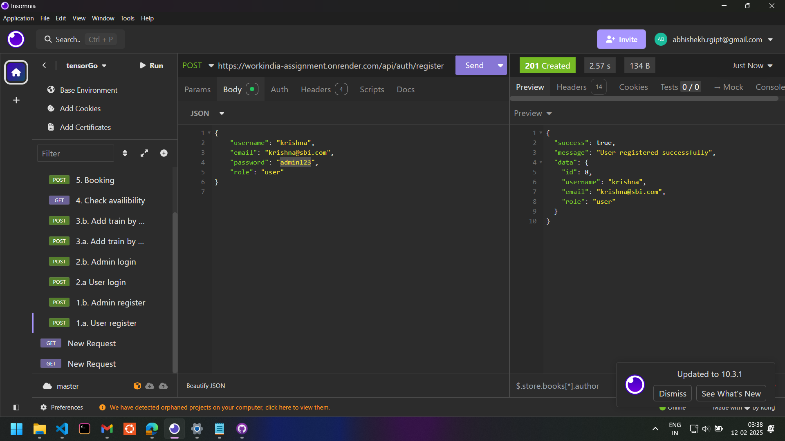
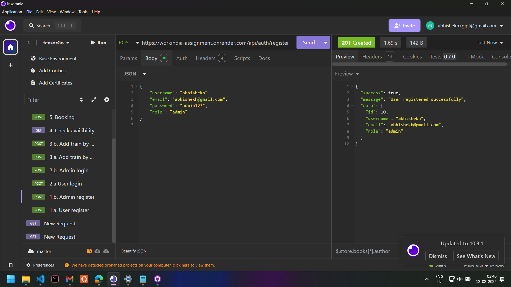
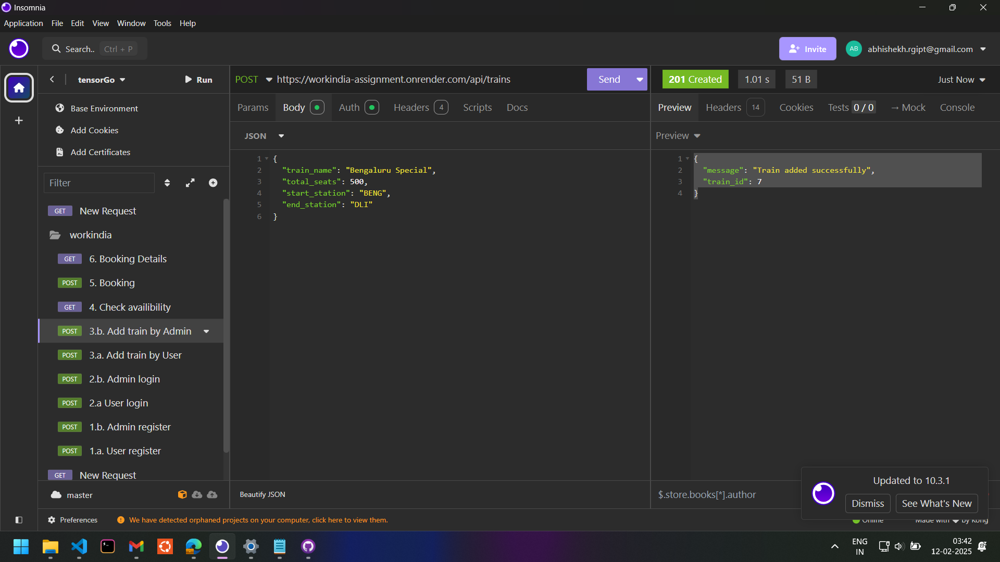
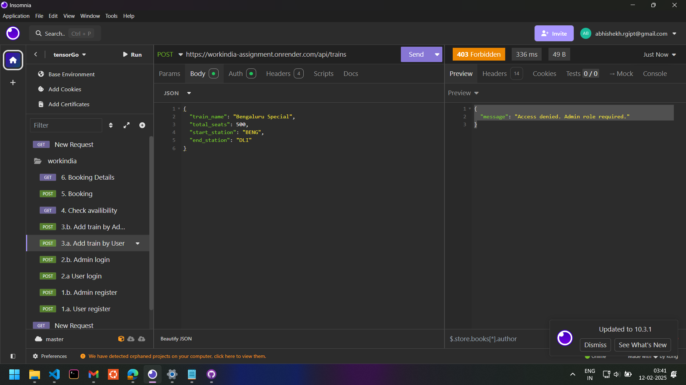
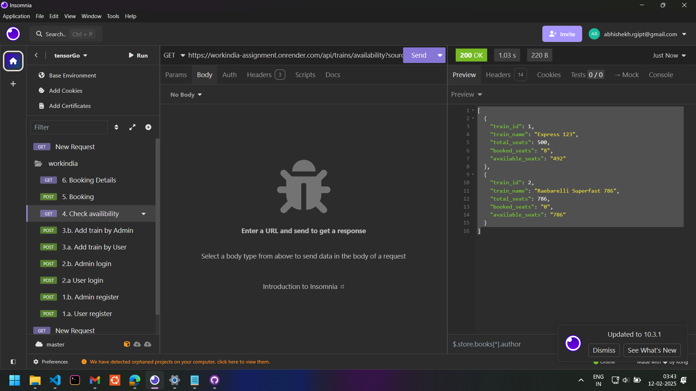
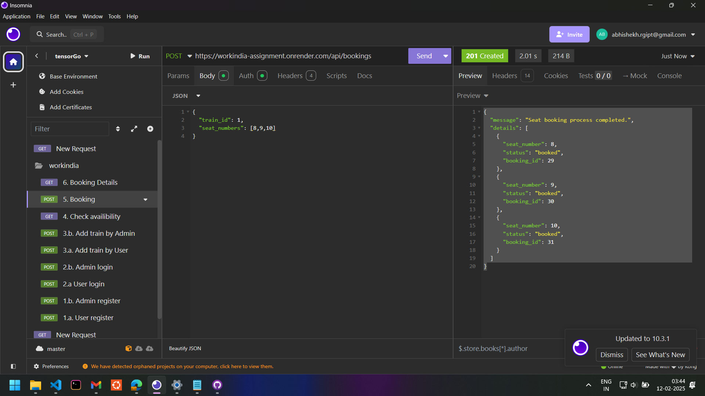
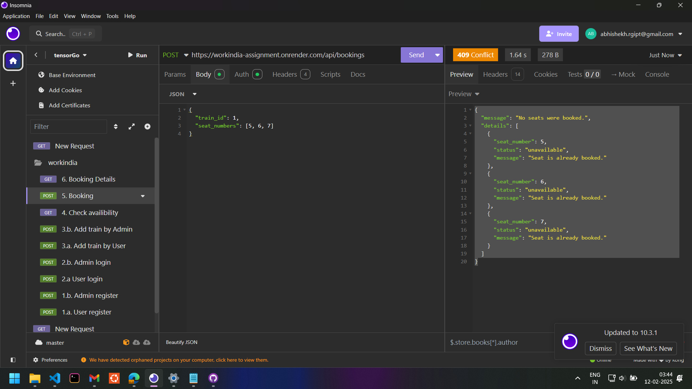
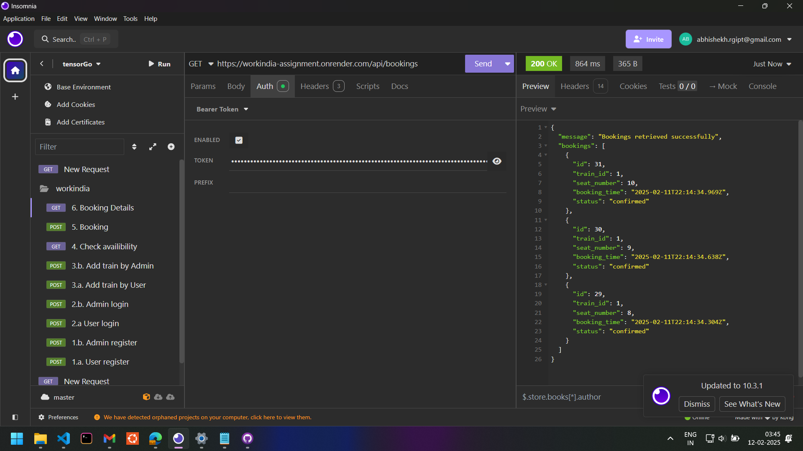

# IRCTC API Clone 
This project is a backend API for a railway management system similar to IRCTC. It allows users to register, log in, check train availability, book seats, and view booking details. Admins can add new trains and manage the system.
## Server is deployed on: https://workindia-assignment.onrender.com/ 
## Table of Contents
- [Features](#features)
- [Endpoints](#endpoints)
  - [User Registration](#user-registration)
  - [Admin Registration](#admin-registration)
  - [User Login](#user-login)
  - [Admin Login](#admin-login)
  - [Add Train by Admin](#add-train-by-admin)
  - [Check Availability](#check-availability)
  - [Book a Seat](#book-a-seat)
  - [Get Booking Details](#get-booking-details)
- [Setup](#setup)
- [Deployment](#deployment)
- [Technologies Used](#technologies-used)

## Features
- **User Authentication:** Register and log in as a user or admin.
- **Train Management:** Admins can add new trains.
- **Seat Availability:** Users can check seat availability between two stations.
- **Booking System:** Users can book seats on available trains.
- **Booking Details:** Users can view their booking details.

## Endpoints
### User Registration
**URL:** `/auth/register`  
**Method:** `POST`  
**Description:** Register a new user.  

#### Request Body:
```json
{
  "username": "krinsha",
  "password": "admin@123",
  "email": "krishna@sbi.com"
}
```
#### Response:
```json
{
  "message": "User registered successfully",
  "userId": 1
}
```


### Admin Registration
**URL:** `/auth/register`  
**Method:** `POST`  
**Description:** Register a new admin.  

#### Request Body:
```json
{
  "username": "admin1",
  "password": "admin123",
  "email": "admin1@example.com",
  "role": "admin"
}
```
#### Response:
```json
{
  "message": "Admin registered successfully",
  "adminId": 1
}
```


### User Login
**URL:** `/auth/login`  
**Method:** `POST`  
**Description:** Log in as a user.  

#### Request Body:
```json
{
  "username": "user1",
  "password": "password123"
}
```
#### Response:
```json
{
  "message": "Login successful",
  "token": "<jwt_token>"
}
```

### Admin Login
**URL:** `/auth/login`  
**Method:** `POST`  
**Description:** Log in as an admin.  

#### Request Body:
```json
{
  "username": "admin1",
  "password": "admin123"
}
```
#### Response:
```json
{
  "message": "Login successful",
  "token": "<jwt_token>"
}
```

### Add Train by Admin
**URL:** `/api/trains`  
**Method:** `POST`  
**Description:** Add a new train (only for admins).  

#### Headers:
```
Authorization: Bearer <admin_jwt_token>
```
#### Request Body:
```json
{
  "train_name": "Express 123",
  "total_seats": 100,
  "start_station": "Station A",
  "end_station": "Station B"
}
```
#### Response:
```json
{
  "message": "Train added successfully",
  "train_id": 1
}
```
### Admin can add trains using their token

### Users can't add train.


### Check Availability
**URL:** `/api/trains/availability`  
**Method:** `GET`  
**Description:** Check seat availability between two stations.  

#### Query Parameters:
- `source`: Starting station (e.g., `Station A`)
- `destination`: Ending station (e.g., `Station B`)

#### Response:
```json
[
  {
    "train_id": 1,
    "train_name": "Express 123",
    "available_seats": 80
  }
]
```


### Book a Seat
### (Only available seats can be booked)
**URL:** `/api/bookings`  
**Method:** `POST`  
**Description:** Book a seat on a specific train.  

#### Headers:
```
Authorization: Bearer <user_jwt_token>
```
#### Request Body:
```json
{
  "train_id": 1,
  "seat_numbers": [5, 6, 7]
}
```
#### Response:
```json
{
  "message": "Seat booking process completed.",
  "details": [
    { "seat_number": 5, "status": "booked", "booking_id": 1 },
    { "seat_number": 6, "status": "unavailable", "message": "Seat is already booked." },
    { "seat_number": 7, "status": "booked", "booking_id": 2 }
  ]
}
```



### Get Booking Details
**URL:** `/api/bookings`  
**Method:** `GET`  
**Description:** Get all bookings for the authenticated user.  

#### Headers:
```
Authorization: Bearer <user_jwt_token>
```
#### Response:
```json
{
  "message": "Bookings retrieved successfully",
  "bookings": [
    {
      "id": 1,
      "train_id": 1,
      "seat_number": 5,
      "booking_time": "2023-10-01T12:34:56.789Z",
      "status": "confirmed"
    }
  ]
}
```


## Setup
### Clone the Repository:
```bash
git clone https://github.com/<your-username>/<your-repo-name>.git
cd <your-repo-name>
```

### Install Dependencies:
```bash
npm install
```

### Set Up Environment Variables:
Create a `.env` file in the root directory and add the following:
```
DATABASE_URL=your_neon_database_url
JWT_SECRET=your_jwt_secret_key
PORT=3000
```

### Run Migrations:
```bash
npm run migrate
```

### Start the Server:
```bash
npm start
```

## Deployment
### Web server is deployed on Render at : https://workindia-assignment.onrender.com/ <br>
### To make your own deployment:
   - Fork this repository.
   - Connect your GitHub repository to Render.
   - Configure the web service with `npm install` and `npm start`.
   - Add environment variables.

## Technologies Used
- **Backend:** Node.js, Express.js
- **Database:** PostgreSQL (Neon)
- **Authentication:** JSON Web Tokens (JWT)
- **Deployment:** Render
